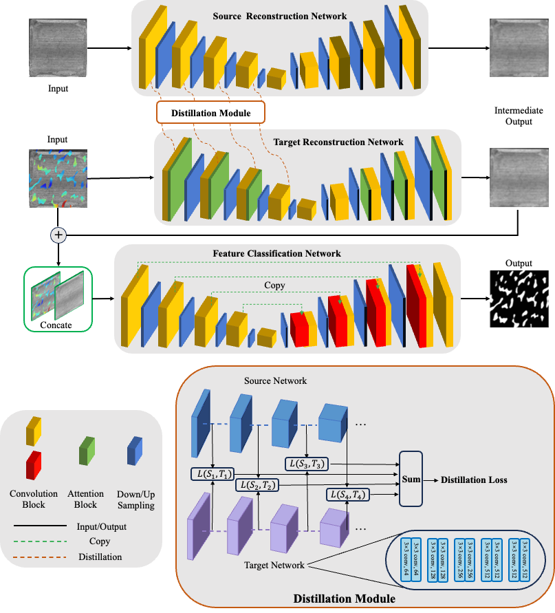
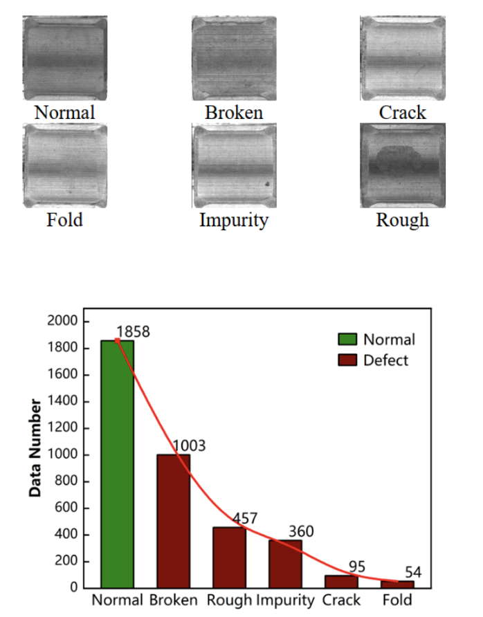
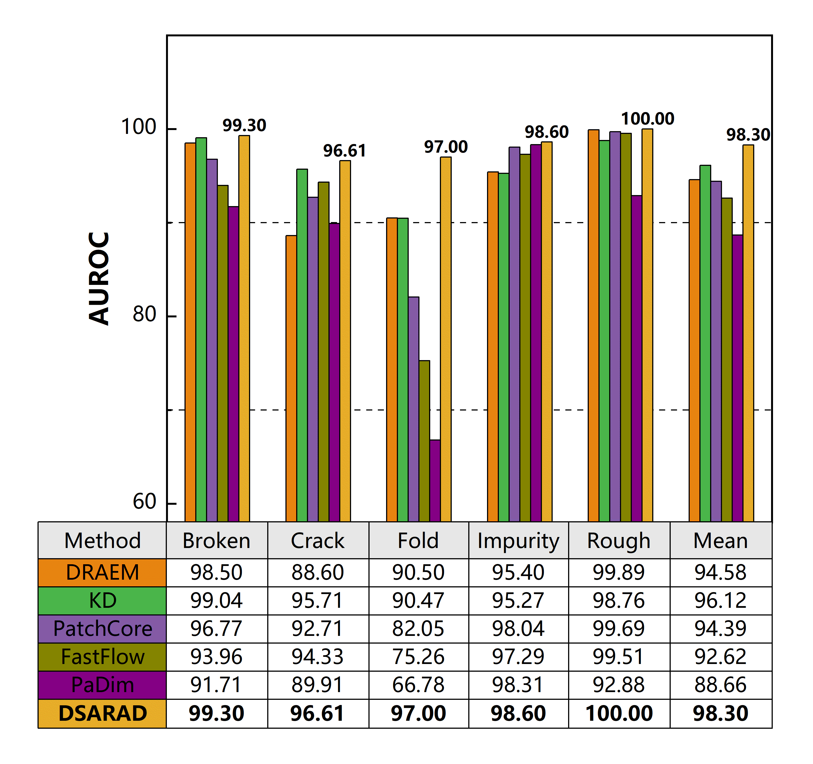

DSARAD is a reconstruction-based algorithm for anomaly detection. It employs an encoder-decoder structure embedded with feature distillation and spatial attention for feature extraction. For feature classification, the algorithm utilizes a U-Net network. DSARAD demonstrates effective detection results for both structural and textural industrial defects.

# DSARAD



## Features

### Dataset and Annotation Software

We have organized a magnetic tile industrial dataset, which includes five types of defects and normal samples. Click [here](https://drive.google.com/uc?export=download\&id=1okU162keIp2xcNrt9m2mCpFOXqk8Ggo5) to download the dataset.The types of defects and data distribution are shown.



We have embedded the anomaly detection results into the annotation software LabelMe, enhancing the speed and accuracy of defect labeling. The annotation software can be downloaded by clicking [here](https://drive.google.com/uc?export=download\&id=131ngDQvPXTIXzuRD_Js-AgD4kVBB9wkP).

### Network

*   Feature DIstillation
*   Spatial attention

### Detection Pipeline

Supervisied Algorithms and Anomaly Detection

## Results

### MVTecAD AUROC score ( mean of 4 trials)

| **Category** | **Image Level AUROC** | **Pixel Level AUROC** |
| :----------: | :-------------------: | :-------------------: |
|    Carpet    |          99.5         |          97.2         |
|     Grid     |         100.0         |          99.6         |
|     Tile     |         100.0         |          99.2         |
|     Wood     |         100.0         |          96.4         |
|    Leather   |         100.0         |          99.3         |
|    Bottle    |          99.9         |          99.2         |
|    Capsule   |          99.1         |          90.7         |
|     Pill     |          98.4         |          96.7         |
|  Transistor  |          95.4         |          88.2         |
|    Zipper    |         100.0         |          98.0         |
|     cable    |          96.3         |          95.2         |
|   Hazelnut   |         100.0         |          99.3         |
|   Metal nut  |         100.0         |          99.4         |
|     Screw    |          98.5         |          98.1         |
|  Toothbrush  |         100.0         |          96.1         |
|     Mean     |        **99.1**       |        **96.8**       |

### &#x20;Magnetic Tile Dataset AUROC score ( mean of 4 trials)



## Getting Started

### Installation

```bash
git clone git@git.tsinghua.edu.cn:wangh23/dsarad.git
cd dsarad
# python=3.7  torch=1.8.0  torchvision=0.9.0 numpy=1.19.0 
pip install -r requirements.txt
```

### Usage

```bash
# cd dsarad/tools
#train
sh train.sh 
#test
sh test.sh
#visual
sh visual.sh

#structure of Dataset
train.txt / test.txt / visual.txt
img1_path
img2_path
....
```

## Contact

*   项目链接: <https://github.com/Wangh277/DSARAD>
*   你的联系邮箱: <wangh23@mails.tsinghua.edu.cn>

